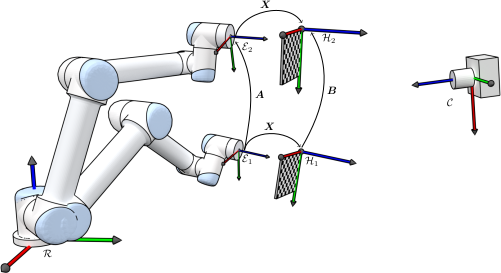

Python code for finding the rigid body transformation X shown in the image.

Test the calibration by running run_calibration.py.
This software requires numpy, scipy and opencv.

image_list.dump contains images of a chessboard mounted on the end-effector of an UR5 robot.
pose_list.dump contains corresponding end-effector poses computed using the UR5 robot kinematics.

Code written by Torstein A. Myhre, 2016